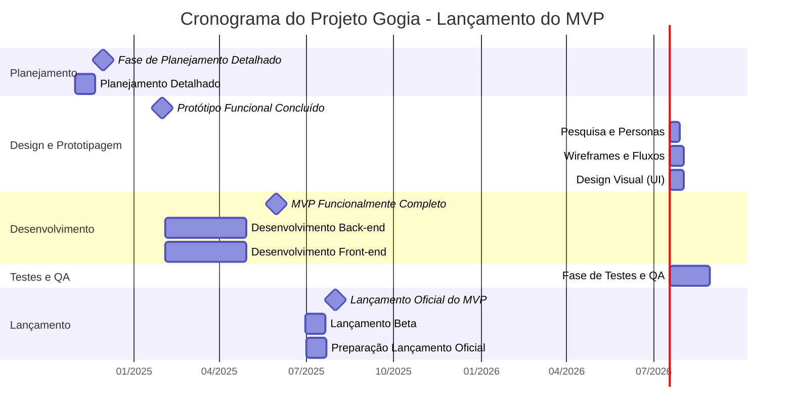

```mermaid
gantt
  title Cronograma do Projeto Gogia - Lançamento do MVP
  dateFormat  YYYY-MM-DD
  axisFormat  %m/%Y
  
  section Planejamento
  Fase de Planejamento Detalhado :milestone, 1.1.2, 2024-11-29, 0d
  Planejamento Detalhado :1.1.1, 2024-10-31, 21d

  section Design e Prototipagem
  Protótipo Funcional Concluído :milestone, 1.2.1.4, 2025-01-31, 0d
  Pesquisa e Personas :1.2.1.1, after 1.1.1, 10d
  Wireframes e Fluxos :1.2.1.2, after 1.2.1.1, 15d
  Design Visual (UI) :1.2.1.3, after 1.2.1.2, 15d

  section Desenvolvimento
  MVP Funcionalmente Completo :milestone, 1.2.4, 2025-05-30, 0d
  Desenvolvimento Back-end :1.2.2, 2025-02-03, 85d
  Desenvolvimento Front-end :1.2.3, 2025-02-03, 85d

  section Testes e QA
  Fase de Testes e QA :1.2.5, after 1.2.4, 42d
  
  section Lançamento
  Lançamento Oficial do MVP :milestone, 1.2.6.4, 2025-08-01, 0d
  Lançamento Beta :1.2.6.1, 2025-06-30, 21d
  Preparação Lançamento Oficial :1.2.6.3, 2025-07-01, 21d
```
