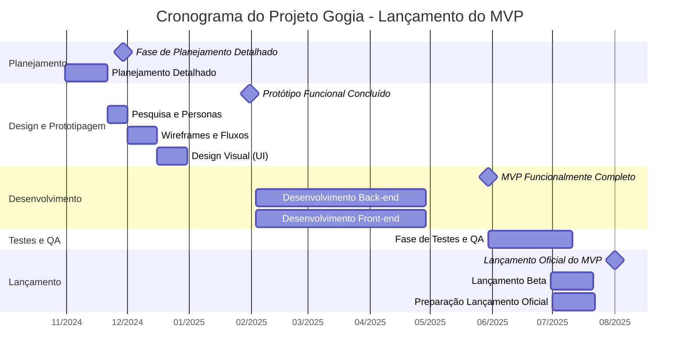

```mermaid
gantt
    title Cronograma do Projeto Gogia - Lançamento do MVP
    dateFormat  YYYY-MM-DD
    axisFormat  %m/%Y
    
    section Planejamento
    Fase de Planejamento Detalhado :milestone, id_112, 2024-11-29, 0d
    Planejamento Detalhado :id_111, 2024-10-31, 21d

    section Design e Prototipagem
    Protótipo Funcional Concluído :milestone, id_1214, 2025-01-31, 0d
    Pesquisa e Personas :id_1211, after id_111, 10d
    Wireframes e Fluxos :id_1212, after id_1211, 15d
    Design Visual (UI) :id_1213, after id_1212, 15d

    section Desenvolvimento
    MVP Funcionalmente Completo :milestone, id_124, 2025-05-30, 0d
    Desenvolvimento Back-end :id_122, 2025-02-03, 85d
    Desenvolvimento Front-end :id_123, 2025-02-03, 85d

    section Testes e QA
    Fase de Testes e QA :id_125, after id_124, 42d
    
    section Lançamento
    Lançamento Oficial do MVP :milestone, id_1264, 2025-08-01, 0d
    Lançamento Beta :id_1261, 2025-06-30, 21d
    Preparação Lançamento Oficial :id_1263, 2025-07-01, 21d
```
